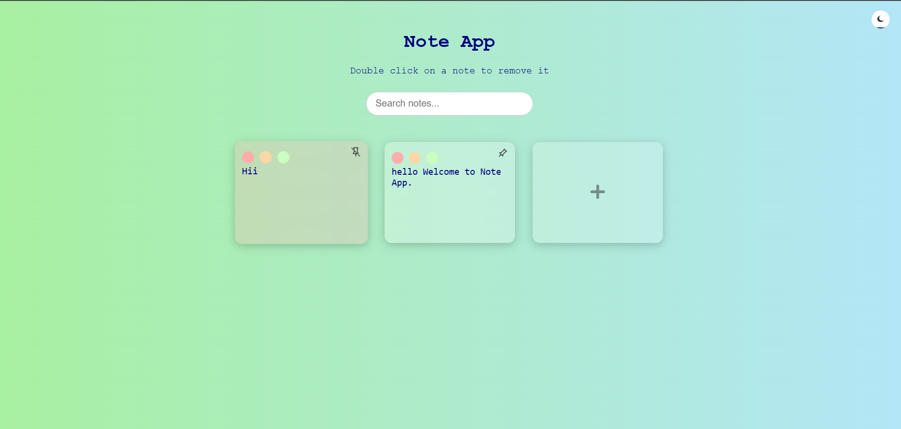
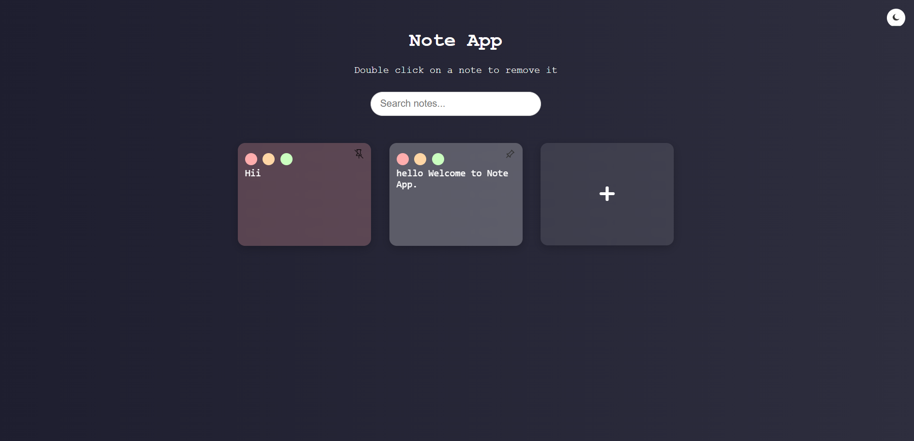

# Modern Note-Taking App

A sleek, minimal, and modern **Note-Taking App** built using HTML, CSS, and JavaScript. This project emphasizes **DOM manipulation**, **Local Storage**, and **glassmorphism UI design**. Users can add, edit, delete, search, pin, and customize note colors. Notes are persisted in the browser using localStorage.

---

## Live Demo

[Click here to view the live app](https://dnitish07.github.io/noteMaker/)

---

## Screenshots

| Light Mode | Dark Mode |
|------------|-----------|
|  |  |

---

## Features

### Core Functionalities
- **Create Notes**: Click the "+" button to add a new note.
- **Edit Notes**: Type directly inside the note, auto-saves to Local Storage.
- **Delete Notes**: Double-click a note to delete with confirmation.
- **Persistent Storage**: Notes persist even after refreshing using `localStorage`.

### Advanced Features
- **Search Notes**: Filter notes instantly using keywords.
- **Pin Notes**: Prioritize and stick important notes to the top.
- **Color Tags**: Assign colors to categorize notes.
- **Dark/Light Mode**: Toggle between themes and persist choice.
- **Drag & Drop**: Reorder notes via basic drag-and-drop functionality.

---

## 🛠 Tech Stack

- **HTML** – Markup structure
- **CSS** – Styling with modern *glassmorphism* and responsive design
- **JavaScript** – Logic for CRUD operations, search, theme toggle, localStorage, etc.

---

## Project Structure

```
note-taking-app/
├── index.html
├── style.css
└── script.js
```

---

## Design Highlights

- Glassmorphism cards using `backdrop-filter`, shadows
- Responsive layout using Flexbox
- Smooth transitions & hover effects
- Clean and user-friendly mobile-first interface

---

## Setup Instructions

1. Clone this repository:
   ```bash
   git clone https://github.com/your-username/note-taking-app.git
